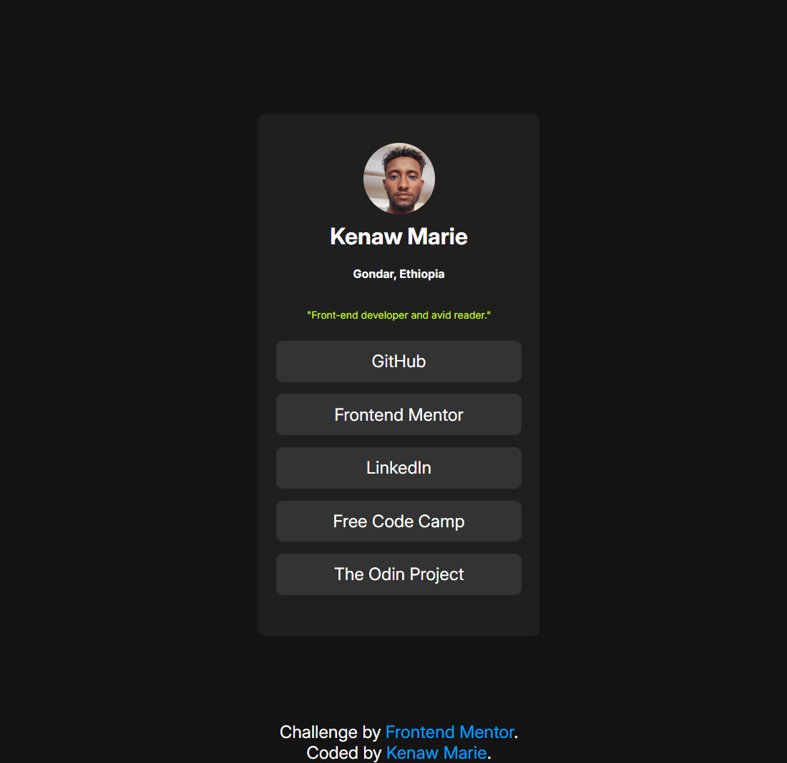

# Frontend Mentor - Social links profile 

This is a solution to the [Social links profile challenge on Frontend Mentor](https://www.frontendmentor.io/challenges/social-links-profile-UG32l9m6dQ).

## Table of contents
 
- [Screenshot](#screenshot)
- [Links](#links) 
- [Built with](#built-with) 
- [Author](#author)
- [Acknowledgments](#acknowledgments)
 

### Screenshot

 

### Links 

- Live Site URL: [front social links profile](http://kenawmarie.github.io/front-social-links-profile/)
 
### Built with

- Semantic HTML5 markup
- CSS custom properties
- Flex box 
  

## Author

- Website - [Add your name here](https://www.your-site.com)
- Frontend Mentor - [@KenawMarie](https://www.frontendmentor.io/profile/KenawMarie) 
 

## Acknowledgments

I would like to say thank you for frontend mentor for this challenge.
